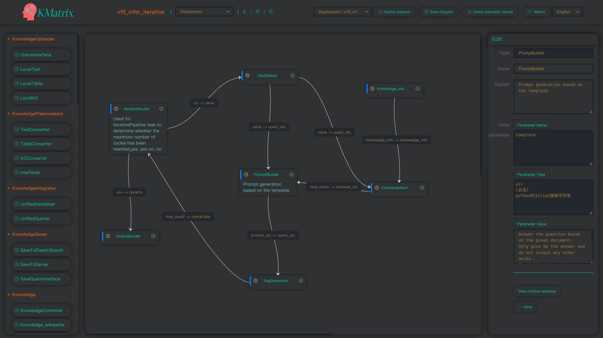

#  :sunflower: KMatrix:  A Flexible Heterogeneous Knowledge Enhancement Toolkit for Large Language Model


 


KMatrix is a flexible heterogeneous knowledge enhancemant toolkit for LLMs.  Our toolkit contains seven stages to complete knowledge-enhanced generation task. All stages are implemented based on our modular component definitions.  Meanwhile, we design a control-logic flow diagram to combine components. The key features of KMatrix include: 

1. Unified enhancement of heterogeneous knowledge: KMatrix uses both verbalizing-retrieval and parsing-query methods to support unified enhancement of heterogeneous knowledge (like free-textual knowledge, tables, knowledge graphs, etc).
2. Systematical adaptive enhancement methods integration: KMatrix offers comprehensive adaptive enhancement methods including retrieval timing judgment and knowledge source selection. 
3. High customizability and easy combinability: our modularity and control-logic flow diagram design flexibly supports the entire lifecycle of various complex Knowledge Enhanced Large Language Models (K-LLMs) systems, including training, evaluation, and deployment.
4. Comprehensive evaluation of K-LLMs systems enhanced by heterogeneous knowledge: we integrate a rich collection of representative K-LLMs knowledge, datasets, and methods, and provide performance analysis of heterogeneous knowledge enhancement. 


## :wrench: Quick Start

### 1. Quick Start from Manual

**Installation** 

To get started with KMatrix, simply clone it from Github and install (requires Python 3.7+ ,  Python 3.10 recommended): 


    $ git clone https://github.com/NLPerWS/KMatrix.git
    
    # It is recommended to use a virtual environment for installation
    $ conda create -n KMatrix python=3.10
    $ conda activate KMatrix
    
    # Install backend environment
    $ cd KMatrix
    $ pip install -r requirements.txt
    
    # Install Frontend environment
    # You need a node environment, and nvm is recommended for node environment management
    # Recommended node environments: 16.20.2
    # You can refer to the fellowing websites to install nvm
    # https://nvm.uihtm.com/#nvm-linux 
    # https://github.com/nvm-sh/nvm
    # After installing the node environment, execute:
    $ cd easy-flow
    $ npm install
    
    # Then, you need to install some third-party tools required by our toolkit
    # Install ES database using Docker
    $ docker pull elasticsearch:8.11.1
    $ docker run -idt  \
        -p 9200:9200 -p 9300:9300 \
        -e "discovery.type=single-node" \
        -e "ES_JAVA_OPTS=-Xms512m -Xmx512m" \
        -e "xpack.security.enabled=true" \
        -e "xpack.security.enrollment.enabled=true" \
        -e "ELASTIC_PASSWORD=yourpassword" \
        -v $(pwd)/elasticsearch_data:/usr/share/elasticsearch/data \
        -v $(pwd)/esplugins:/usr/share/elasticsearch/plugins \
        --name elasticsearch elasticsearch:8.11.1
        
    We upload knowledge and the datasets to ModelScope: https://www.modelscope.cn/datasets/KMatrixRep/KMatrix_Rep
    Use the following commands to download:
    $ git lfs install
    $ git clone https://www.modelscope.cn/datasets/KMatrixRep/KMatrix_Rep.git
    you can download it, it contains:
    dir_dataset/
    dir_knowledge/
    dir_model/
    use the downloaded folders to replace the original folders in KMatrix directory.
    
    # You need to import knowledge into ES database for Retrieval, our knowledge samples locate in dir_knowledge/local_knowledge_verlized/, you need to create three indexes in ES named 'wikipedia','wikidata','wikitable', and their corresponding files are respectively Wikipedia/wikipedia.jsonl, wikidata/wiki_data.jsonl, wikitable/wikitable.jsonl. After that, you can use retrieval model to retrieve the knowledge in the database.

**StartUp**


    If you have successfully installed the environment, a quick start will be easy.
    
    1. Set configurations that needs to be modified in the root_config.py file located in the project root directory, if necessary. Set the SERVER_HOST in easy-flow/src/assets/js/host.js to the IP address of deployment server.
    
    2. Start the toolkit by executing following command: 
    $ cd KMatrix/easy-flow
    $ npm run dev
    $ cd KMatrix
    $ python flask_server.py
    Visit KMatrix toolkit using the browser: http://yourserverip:8000
    
    3. Construct and Execute Flow diagram
    You can construct K-LLMs systems using our modular component and control-logic flow diagram, and execute it. Details of K-LLMs systems construction can be found in toolkit usage. You can use a flow diagram we have built (a K-LLMs system actively querying multiple knowledge interfaces) for a quick start:
    Click the [Use exising diagram] drop-down box on the frontend of toolkit, select Deployment/v16_cok_de_diagram, and then click the [Deploy diagram] button to start the deployment. After the deployment completes, enter your question in the question box and click [send] to generate reasoning steps and answer.

### 2. Quick Start from Docker (recommended)

`````
$ git clone https://github.com/NLPerWS/KMatrix.git
$ chmod +x -R KMatrix
Set configurations that needs to be modified in the root_config.py file located in the project root directory, if necessary. Set the SERVER_HOST in easy-flow/src/assets/js/host.js to the IP address of deployment server.

# Install ES database using Docker
$ docker pull elasticsearch:8.11.1
$ docker run -idt  \
    -p 9200:9200 -p 9300:9300 \
    -e "discovery.type=single-node" \
    -e "ES_JAVA_OPTS=-Xms512m -Xmx512m" \
    -e "xpack.security.enabled=true" \
    -e "xpack.security.enrollment.enabled=true" \
    -e "ELASTIC_PASSWORD=yourpassword" \
    -v $(pwd)/elasticsearch_data:/usr/share/elasticsearch/data \
    -v $(pwd)/esplugins:/usr/share/elasticsearch/plugins \
    --name elasticsearch elasticsearch:8.11.1

$ docker pull leap233/kmatrix:v1
$ cd KMatrix
$ sh docker_start.sh
`````


## :dizzy: Toolkit Usage

We provide a  screencast video of our toolkit at [here](https://youtu.be/VL-zY2pphwI) which explained the tool usage instructions.

### 1 K-LLMs System Construction

KMatrix constructs K-LLMs system using two stages：

- Selecting  components and  configuring  parameters

- Constructing components logic relations using control-logic flow diagram 

#### 1.1 Selecting  components and  configuring  parameters

KMatrix component is an functional unit of K-LLMs system. We unify datasets, knowledge, and models involved in K-LLMs as components. KMatrix defines 16 types of components, like Retriever, Query Parser, Generator, etc. 

| Component Class           | Component Instance                     | Instance Description                                         |
| ------------------------- | -------------------------------------- | ------------------------------------------------------------ |
| **KnowledgeUploader**     | OnlineInterface                        | Online knowledge interfaces access                           |
|                           | Local_Text                             | Local texual knowledge access                                |
|                           | Local_Table                            | Local table knowledge access                                 |
|                           | Local_KG                               | Local knowledge graph access                                 |
| **KnowledgePreprocessor** | TextConvertor                          | Format processing of local texual knowledge                  |
|                           | TableConvertor                         | Format processing of local table knowledge                   |
|                           | KGConvertor                            | Format processing of local knowledge graph                   |
|                           | Interfacer                             | Online knowledge interface standardization                   |
| **KnowledgeIntegrator**   | UnifiedVerbalizer                      | Convert various types of local heterogeneous knowledge into unified text  for knowledge integration |
|                           | UnifiedQuerier                         | Incorporate different types of knowledge query interfaces for knowledge integration |
| **KnowledgeSaver**        | SaveToElasticSearch                    | Save the data to ES database                                 |
|                           | SaveToServer                           | Save the data to File system                                 |
|                           | SaveQueryInterface                     | Save interfaces for active query                             |
| **Knowledge**             | KnowledgeCombiner                      | Load knowledge from ES database                              |
|                           | Knowledge_wikipedia                    | Load Wikipedia knowledge from ES database                    |
|                           | Knowledge_wikipedia_wikidata           | Load Wikipedia+Wikidata knowledge from ES database           |
|                           | Knowledge_wikipedia_wikidata_wikitable | Load Wikipedia+Wikidata+Wikitable knowledge from ES database |
|                           | KnowledgeSelector                      | Load unified querier service, used in active query           |
| **Retriever**             | Bm25MemoryRetriever                    | BM25 memory retrieval model                                  |
|                           | Bm25EsRetriever                        | BM25 retrieval for ES database                               |
|                           | ContrieverRetriever                    | BERT-based retrieval model                                   |
|                           | DPR_retriever                          | BERT-based retrieval model                                   |
|                           | BGE_retriever                          | BERT-based retrieval model                                   |
|                           | BERT_retriever                         | Basic retrieval model                                        |
|                           | E5_retriever                           | LLM-based retrieval model                                    |
| **QueryGenerator**        | NL Parser                              | Natural language query generator                             |
|                           | Sparql Parser                          | Sparql language query generator                              |
| **Adaptive Interactor**   | Special Token-Timing Judgment          | Adaptive retrieval timing judgment                           |
|                           | Self Consistency-Timing Judgment       | Adaptive retrieval timing judgment                           |
|                           | Example demonstration-Source Selection | Adaptive retrieval source selection                          |
| **Generator**             | OpenAIGenerator                        | Closed-source general  generator                             |
|                           | RagGenerator                           | Retrieval instructions-enhanced generator                    |
|                           | LLama2Generator                        | Open-source general  generator                               |
|                           | Baichuan2Generator                     | Open-source general  generator                               |
| **Multiplexer**           | Multiplexer                            | Pass data to multiple components simultaneously              |
| **PromptBuilder**         | PromptBuilder                          | Create customized prompts                                    |
| **OutputBuilder**         | OutputBuilder                          | Receive and normalize the output of system flow diagram      |
| **Router**                | ConditionalRouter                      | Execute different branches based on conditions               |
| **Evaluation**            | Evaluator                              | Manage K-LLMs system evaluation process                      |
| **Controller**            | SelfRagShortDemoController             | Adaptive K-LLMs control flow diagram                         |
|                           | CokController                          | Adaptive K-LLMs control flow diagram                         |
| **DataSet**               | DataSet_*                              | Datasets loading and using                                   |

Users can select these predefined components or define their own components according to predefined formats. And configure component  parameters in KMatrix graphical interface. 

#### 1.2 Constructing components logic relations using control-logic flow diagram

We can use logic or control flow diagrams to organize component relationships for K-LLMs system construction. 

- **Deploy Control Flow Diagram:** for K-LLMs system with complex process (including multifarious arithmetic operations and logical judgments), we can use control flow diagram to design system process using Python programming.  Adding components to a  control flow diagram, and programming components logics.

​		step1: Adding components to a  control flow diagram.

<div align=center></div>


​		step2: programming components logics using python.

<div align=center></div>


- **Deploy Logic Flow Diagram:** for K-LLMs system with concise process (like linear, branching, looping, and conditional structures), we can employ logic flow diagram to directly connect components with edges. By jointly using control and logic flow diagram, KMatrix flexibly supports common K-LLMs patterns using naive, iterative, and adaptive enhancement methods. Draging components into the design area, and connecting them to build K-LLMs system. 




- **Flow diagram design approachs for training, evaluation, and deployment of K-LLMs system**: for component training and evaluation, users can simply connect the Dataset component with the component to be trained/evaluated. For end-to-end evaluation of the K-LLMs system, users can employ the Evaluator component to connect Dataset component with K-LLMs system, and the Evaluator component will manage evaluation process. For K-LLMs system deployment, users can map the task inputs to the Multiplexer, and connect the task outputs to the OutputBuilder on the basis of original system flow diagram. After constructing system flow diagram, Users can excute it. 


- **Integrated pre-built K-LLMs systems flow diagram instances:** we have integrated some pre-built K-LLMs systems flow diagram instances for user use, which contain four categories: Knowledge Integration, Training, Evaluation, Deployment for heterogeneous knowledge integration, K-LLMs system training, evaluation, deployment respectively. Users can click the [Use exising diagram] drop-down box on the frontend of toolkit, and use the corresponding flow diagram according to the Name.

| Name                                        | Category              | Function Description                                         |
| :------------------------------------------ | :-------------------- | :----------------------------------------------------------- |
| Knowledge Integration/v16_save_upload_to_ES | Knowledge Integration | Converting various types of local heterogeneous knowledge (such as text, tables and knowledge graphs) into unified text fragments for local knowledge integration. |
| Knowledge Integration/v16_UnifiedQuery      | Knowledge Integration | Incorporating different types of knowledge query interfaces (like Wikipedia, Wikidata) for online knowledge integration. |
| Training/v16_train_selfrag                  | Training              | SelfRag Generator component training.                        |
| Training/v16_train_contriever               | Training              | Contriever Retriever component training.                     |
| Training/v16_train_BGE                      | Training              | BGE Retriever component training.                            |
| Evaluation/v16_eva_contriever               | Evaluation            | Contriever Retriever component evaluation.                   |
| Evaluation/v16_eva_BGE                      | Evaluation            | BGE Retriever component evaluation.                          |
| Evaluation/v16_eva_Iterative                | Evaluation            | Evaluation of a Iterative K-LLMs system using local heterogeneous knowledge . |
| Evaluation/v16_eva_selfRAG_short            | Evaluation            | Evaluation of an adaptive K-LLMs system using local heterogeneous knowledge. |
| Deployment/v16_infer_naive_rag              | Deployment            | Deployment of a naive K-LLMs system using local heterogeneous knowledge. |
| Deployment/v16_cok_de_diagram               | Deployment            | Deployment of an adaptive K-LLMs system using multiple knowledge query interfaces. |
| Deployment/v16_infer_selfRAG_short          | Deployment            | Deployment of an adaptive K-LLMs system using heterogeneous knowledge. |
| Deployment/v16_infer_iterative              | Deployment            | Deployment of a Iterative K-LLMs system using heterogeneous knowledge. |


### 2 K-LLMs System Execution

After constructing system flow diagram, Users can execute it. 

1. K-LLMs system training and evaluation flow diagram execution:  Click [Execute diagram] button to execute it, and click [Check execution results] to view the training or evaluation result logs.
2. K-LLMs system deployment flow diagram execution: Click the [Deploy diagram] button to deploy it.  After completing deployment, enter your question in the question box and click [send] to generate reasoning steps and answer. The K-LLMs system deployment interface with multiple knowledge bases and multiple queries is shown in the following figure.


##  :notebook: Knowledge And Datasets

**Knowledge**:  KMatrix designs two ways of knowledge access: local knowledge and online interface. To support heterogeneous knowledge enhancemant, for local knowledge, we integrate public Wikipedia (text), Wikidata (knowledge graph) and Wikitable (table). For online interface, we integrate two general knowledge interfaces(Wikipedia and Wikidata query APIs) and six domain knowledge interfaces (APIs including Uptodate, CK12, etc). 

| Knowledge Access Way | Knowledge Name   | Knowledge Scale |
| -------------------- | ---------------- | --------------- |
| local knowledge      | Wikipedia        | 21000k          |
|                      | Wikidata         | 5790k           |
|                      | Wikitable        | 6860k           |
| online interface     | Wikipedia        | /               |
|                      | Wikidata         | /               |
|                      | Uptodate         | /               |
|                      | Flashcard        | 33553           |
|                      | BioScienceqa     | 1062            |
|                      | CK12             | /               |
|                      | PhyScienceqa     | 780             |
|                      | Physicsclassroom | /               |


**Dataset**:  KMatrix provides five classes of datasets to support evaluation of K-LLMs system. We provide RETRIEVE\_TRAIN and RETRIEVE_EVAL to train and evaluate Retriever components. We provide GENERATOR\_TRAIN for adaptive retrieval training of  Generator components. We provide ODQA_EVAL and ODQA_EVAL_Simplified to evaluate knowledge enhancement performance of K-LLMs system under two ways of knowledge access: local knowledge and online interface respectively.  

| Dataset Class        | Dataset Name | Dataset Scale |
| -------------------- | ------------ | ------------- |
| RETRIEVE_TRAIN       | MSMARCO      | 480k          |
|                      | NQ           | 58k           |
|                      | HotpotQA     | 84k           |
| RETRIEVE_EVAL        | ArguAna      | 1401          |
|                      | FiQA2018     | 6648          |
|                      | HotpotQA     | 98k           |
|                      | MSMARCO      | 510k          |
|                      | NFCorpus     | 3237          |
|                      | NQ           | 3452          |
|                      | Quora        | 15k           |
|                      | SciFact      | 1109          |
| GENERATOR_TRAIN      | SelfRAG      | 146k          |
| ODQA_EVAL            | 2Wikiqa      | 12576         |
|                      | Hotpotqa     | 7405          |
|                      | NQ           | 3610          |
|                      | Popqa        | 1399          |
|                      | Squad        | 10570         |
|                      | Triviaqa     | 7313          |
|                      | Webqa        | 2032          |
| ODQA_EVAL_Simplified | Hotpotqa     | 308           |
|                      | Medmcqa      | 146           |
|                      | MMLU_bio     | 454           |
|                      | MMLU_phy     | 253           |


## :page_facing_up: Experimental Results

We report experimental results from two aspects: Knowledge access performance evaluation and Single vs. multi-knowledge bases enhancement evaluation.

1. Knowledge access performance evaluation, which reports  the knowledge access performance of five Retriever components. 				

|            | ArguAna      |        | FiQA2018 |        | HotpotQA  |        | MSMARCO     |        |
| ---------- | ------------ | ------ | -------- | ------ | --------- | ------ | ----------- | ------ |
|            | map@100      | r@100  | map@100  | r@100  | map@100   | r@100  | map@100     | r@100  |
| BERT       | 6.87%        | 34.48% | 0.04%    | 0.71%  | 0.07%     | 0.5%   | 0.0%        | 0.02%  |
| Contriever | 24.59%       | 97.36% | 27.38%   | 65.25% | 55.27%    | 77.76% | 21.90%      | 25.97% |
| DPR        | 21.33%       | 89.94% | 11.75%   | 38.48% | 31.25%    | 57.83% | 16.00%      | 58.13% |
| BGE        | 28.4%        | 96.79% | 37.55%   | 75.42% | 48.58%    | 64.89% | 36.28%      | 88.73% |
| E5         | 30.50%       | 99.22% | 41.80%   | 79.52% | 39.04%    | 71.03% | 21.99%      | 78.27% |
|            | **NFCorpus** |        | **NQ**   |        | **Quora** |        | **SciFact** |        |
|            | map@100      | r@100  | map@100  | r@100  | map@100   | r@100  | map@100     | r@100  |
| BERT       | 0.28%        | 3.22%  | 0.03%    | 0.30%  | 41.26%    | 67.85% | 1.56%       | 14.26% |
| Contriever | 15.33%       | 29.93% | 43.23%   | 92.71% | 83.06%    | 99.35% | 62.88%      | 94.20% |
| DPR        | 6.79%        | 17.90% | 22.29%   | 73.00% | 78.47%    | 97.78% | 29.95%      | 70.23% |
| BGE        | 18.00%       | 33.94% | 44.66%   | 93.39% | 86.15%    | 99.70% | 69.04%      | 97.17% |
| E5         | 11.42%       | 27.19% | 10.28%   | 41.22% | 85.57%    | 99.65% | 70.40%      | 96.00% |

2. Single vs. multi-knowledge bases enhancement evaluation using local knowledge access way, which reports four K-LLMs systems performance using three types of local heterogeneous Knowledge: Wikipedia(Text)+Wikidata(KG)+Wikitable(Table). The K-LLMs systems include Naive-GEN(answer generation without knowledge), Naive-RAG(naive K-LLMs), Interleave (iterative K-LLMs) and Self-RAG (adaptive K-LLMs). 

| Methods    | Knowledge                                     | PopQA  | TriviaqaQA | NQ     | HotpotQA | 2Wikiqa | WebQA  |
| ---------- | --------------------------------------------- | ------ | ---------- | ------ | -------- | ------- | ------ |
| Naive-GEN  | Without                                       | 14.44% | 35.00%     | 8.53%  | 11.45%   | 17.57%  | 17.03% |
|            | Wikipedia(Text)                               | 27.51% | 54.63%     | 33.77% | 20.39%   | 22.07%  | 31.74% |
| Naive-RAG  | Wikipedia(Text)+Wikidata(KG)                  | 42.82% | 54.18%     | 33.68% | 20.73%   | 23.19%  | 31.10% |
|            | Wikipedia(Text)+Wikidata(KG)+Wikitable(Table) | 42.89% | 54.68%     | 34.13% | 20.47%   | 23.43%  | 31.05% |
|            | Wikipedia(Text)                               | 25.80% | 39.6%      | 24.96% | 14.7%    | 18.03%  | 22.74% |
| Interleave | Wikipedia(Text)+Wikidata(KG)                  | 41.03% | 47.12%     | 25.01% | 16.38%   | 18.26%  | 23.23% |
|            | Wikipedia(Text)+Wikidata(KG)+Wikitable(Table) | 41.17% | 46.27%     | 25.43% | 16.22%   | 22.1%   | 23.47% |
|            | Wikipedia(Text)                               | 41.95% | 58.38%     | 29.28% | 25.80%   | 29.34%  | 34.69% |
| Self-RAG   | Wikipedia(Text)+Wikidata(KG)                  | 61.37% | 58.23%     | 28.92% | 25.91%   | 29.99%  | 34.30% |
|            | Wikipedia(Text)+Wikidata(KG)+Wikitable(Table) | 61.37% | 58.57%     | 29.25% | 25.71%   | 30.12%  | 34.84% |


3. Single vs. multi-knowledge bases enhancement evaluation using online interface access way, which reports three K-LLMs methods performance using eight knowledge interfaces from four domains. The K-LLMs methods include the COT method without knowledge enhancement, selective query across multiple-domain knowledge interfaces, fixed query on single-domain knowledge interface.

| Methods                    | Knowledge                                                    | Factual Domain | Medical Domain | Physics Domain | Biology Domain |
| -------------------------- | ------------------------------------------------------------ | -------------- | -------------- | -------------- | -------------- |
|                            |                                                              | Hotpotqa       | Medmcqa        | MMLU_phy       | MMLU_bio       |
| COT                        | Without                                                      | 37.99%         | 40.41%         | 45.85%         | 78.63%         |
| COK-DE<br/>Selective Query | Four domains, eight<br/>knowledge interfaces<br/>(Text,KG,Table) | 40.58%         | 46.58%         | 50.2%          | 78.63%         |
| COK-DE<br/>Fixed Query     | Four domains, eight<br/>knowledge interfaces<br/>(Text,KG,Table) | 38.96%         | 44.52%         | 49.8%          | 77.97%         |


##   :raised_hands: Additional FAQs

- Q: Why do connection edges sometimes become disordered when constructing a flow diagram?
  
  A: This issue may occur if you delete a component and make further edits to the flow diagram. To resolve this, simply save the flow diagram firstly, refresh the page, and reload the flow diagram.
  
- ......


## 🔖 License

Apache 2.0 License.
